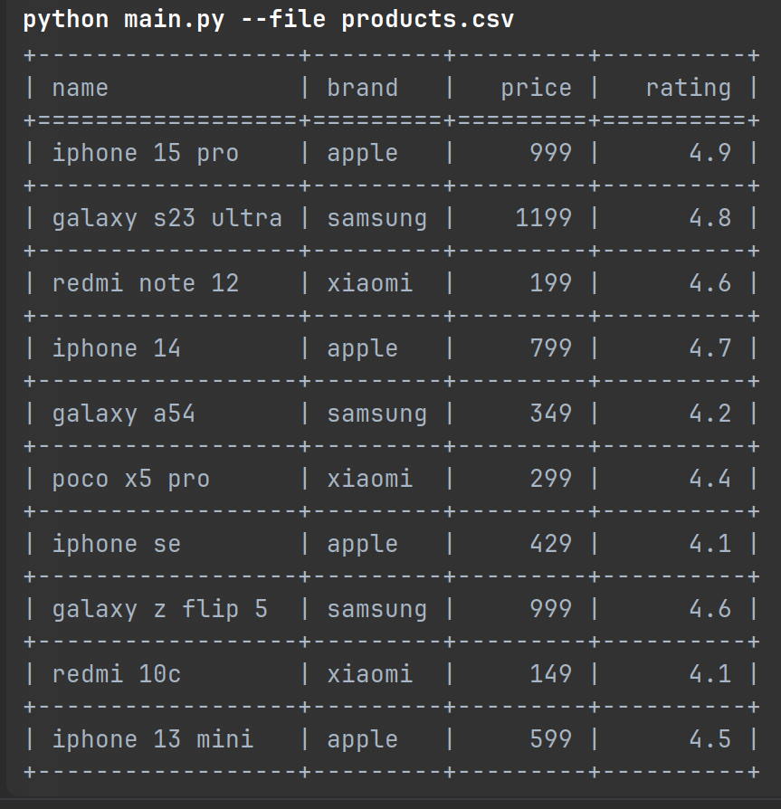

# file-handler

Скрипт для обработки CSV-файлов с поддержкой фильтрации, агрегации и сортировки.

## Возможности

- **Фильтрация** по одной колонке с операторами `>`, `<`, `=`
- **Агрегация** числовых колонок: `avg`, `min`, `max`
- **Сортировка** по колонке: `asc`/`desc`
- Обработка ошибок пользователя
- Расширяемая архитектура

## Установка

1. Установите **uv** (если ещё не установлен):

```bash
curl -LsSf https://astral.sh/uv/install.sh | sh
# или через pipx
pipx install uv
```

2. Создайте виртуальное окружение и активируйте его:

```bash
uv venv
source .venv/bin/activate  # Linux/Mac
# или
.venv\Scripts\activate  # Windows
```

3. Установите зависимости:

```bash
uv sync
```

## Использование

### Базовый запуск
```bash
python main.py --file products.csv
```


### Фильтрация
```bash
# Фильтрация по числовой колонке
python main.py --file products.csv --where "price>100"

# Фильтрация по строковой колонке
python main.py --file products.csv --where "brand=apple"
```

### Агрегация
```bash
# Среднее значение
python main.py --file products.csv --aggregate "avg:price"

# Минимальное значение
python main.py --file products.csv --aggregate "min:price"

# Максимальное значение
python main.py --file products.csv --aggregate "max:price"
```

### Сортировка
```bash
# По возрастанию
python main.py --file products.csv --order-by "price=asc"

# По убыванию
python main.py --file products.csv --order-by "brand=desc"
```

### Комбинирование операций
```bash
# Фильтрация + сортировка
python main.py --file products.csv --where "price>100" --order-by "price=desc"

# Фильтрация + агрегация
python main.py --file products.csv --where "brand=apple" --aggregate "avg:price"
```

## Пример файла CSV

```csv
name,brand,price,rating
iphone 15 pro,apple,999,4.9
galaxy s23 ultra,samsung,1199,4.8
redmi note 12,xiaomi,199,4.6
poco x5 pro,xiaomi,299,4.4
```

## Тестирование

```bash
# Запуск тестов
pytest

# С покрытием
pytest --cov=.
```

## Обработка ошибок

Скрипт корректно обрабатывает:
- Несуществующие файлы
- Некорректные условия фильтрации
- Нечисловые значения в агрегации
- Неверные форматы сортировки
- Отсутствующие колонки 